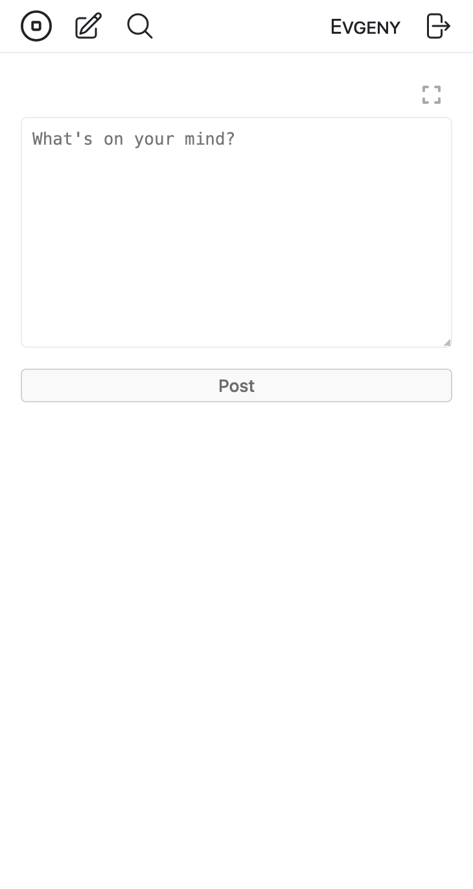
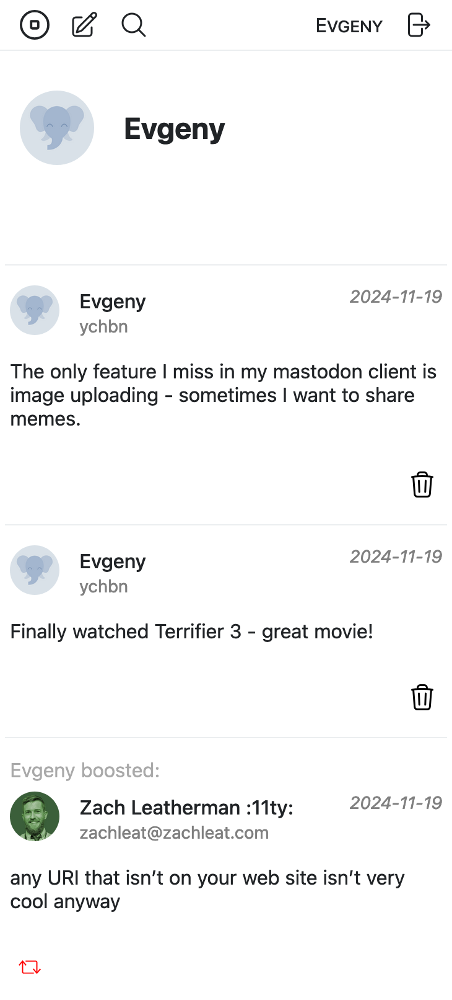

# Lmst - web client for Mastodon

Lmst is a web client for Mastodon that focuses on small size
and simple interface.

## How it's different

Lmst has very small bundle size - **up to 10 kB**, and this limit won't be increased in the future.
This is the mandatory requirement.

Also it has zero dependencies, so it won't suffer from a library that
became deprecated. As a consequence, lmst offers a very small subset
of features: 

- Follow/unfollow profile
- Write text-only statuses/replies
- Boost/unboost statuses
- Delete own statuses

## Screenshots

### Compose page
<table>
  <tr>
    <th></th>
  </tr>
</table>

### Zen mode
<table>
  <tr>
    <th></th>
  </tr>
</table>

### Home page
<table>
  <tr>
    <th></th>
  </tr>
</table>
